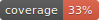

# c4cs-w17-rpm

I used the python coverage library to do this so there isn't a badge for it :/ I did however add a nifty .svg image that I created on my own :D The link will take you to the image on my repo

[]

